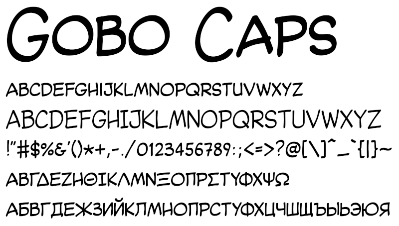

# Gobo Caps

## Description

Gobo Caps is an OpenType Unicode font simulating professional manual lettering of comics and graphic novels. The current version provides the following weights:

* Regular

with full support of Unicode blocks

* Basic Latin
* Latin-1 Supplement
* Latin Extended-A

and partial support of

* Latin Extended-B
* Spacing Modifier Letters
* Greek and Coptic
* Cyrillic
* Latin Extended Additional
* General Punctuation
* Currency Symbols
* Miscellaneous Symbols

In addition to standard Unicode glyphs Gobo Caps contains a full set of double letter ligatures for lower case basic latin letters and a context-sensitive barred / barless I.

## Installing

Ready-made font files are found in the fonts folder. Download the raw file and use the standard platform-specific procedure to install it.

## Resources

The source directory provides:

* the FontForge project files
* individual glyphs in SVG format
* individual unmerged glyphs in ODG format
* a workbench file containing the glyph guideline grid and individual graphic elements for glyph composition

The resources have been created with the following software:

* FontForge V20230101
* InkScape V1.4
* LibreOffice V24.2.4.2

## Author

Copyright (c) 2025 by Terhi Mäkinen [terhimakin@gmail.com](mailto:terhimakin@gmail.com) with Reserved Font Name "Gobo Caps".

## License

This font software is provided under the [SIL Open Font License (OFL) version 1.1](https://openfontlicense.org/open-font-license-official-text/).

## Version history

### 1.000

Initial release

### 1.001

* fixed a bug that prevented kerning of Greek and Cyrillic script
* added more fine-grained kerning classes
* modified some Greek and Cyrillic glyphs
* fixed a bug that prevented the application of the eacute_e ligature
* made endash a ligature of two and emdash a ligature of three hyphens
* added all Latin letters up to and including Extended-A to the context classes of barred I
* moved glyphs U+E040 and U+E041 to their proper place at U+269E and U+269F and made them ligatures of =( and )= respectively

### 1.002

* added and modified some Greek and Cyrillic glyphs

## Bug reports

Send bug reports to Terhi Mäkinen [terhimakin@gmail.com](mailto:terhimakin@gmail.com)

